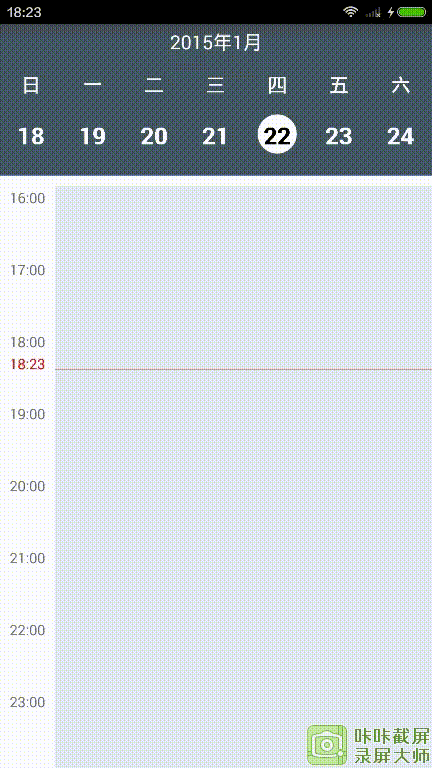
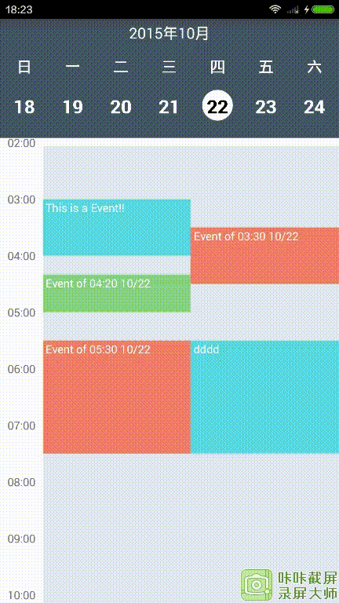

# sample-of-Android-week-view
This is a sample of android week view,Thanks the author of android week view ,The WeekHeaderView is based on android week view .This project contains two view ,the header view and day view.You can add events .Please watch the rederings




Features
------------
* week header view
* week day view 
* add events
* Horizontal and vertical scrolling.

Usage
---------
1. Import the library into your project.
2. Add WeekHeaderView and WeekDayView in your xml layout.
```xml
<RelativeLayout xmlns:android="http://schemas.android.com/apk/res/android"
    xmlns:app="http://schemas.android.com/apk/res-auto"
    xmlns:tools="http://schemas.android.com/tools"
    android:layout_width="match_parent"
    android:layout_height="match_parent"
    tools:context=".MainActivity">

    <TextView
        android:id="@+id/tv_date"
        android:layout_width="match_parent"
        android:layout_height="30dp"
        android:background="#455964"
        android:gravity="center"
        android:text="2015年1月"
        android:textColor="#ffffff"
        android:textSize="16sp"/>

    <com.guojunustb.library.WeekHeaderView
        android:id="@+id/weekheaderview"
        android:layout_width="match_parent"
        android:layout_height="wrap_content"
        android:layout_below="@+id/tv_date"
        app:firstDayOfWeek2="sunday"
        app:headerBackgroundColor="#455964"
        app:headerDayLabelNormalTextColor="#ffffff"
        app:headerDayLabelTextSize="20sp"
        app:headerDayLabelTodayTextColor="@android:color/holo_red_dark"
        app:headerFocusBackgroundColor="#ffffff"
        app:headerFocusSameDayBackgroundColor="#ffffff"
        app:headerFocusSameDayTextColor="#000000"
        app:headerFocusTextColor="#000000"
        app:headerPaddingTop="20dp"
        app:headerRowGap="40dp"
        app:headerWeekLabelTextColor="#ffffff"
        app:headerWeekLabelTextSize="16sp" />

    <com.guojunustb.library.WeekDayView
        android:id="@+id/weekdayview"
        android:layout_width="match_parent"
        android:layout_height="match_parent"
        android:layout_below="@+id/weekheaderview"
        android:visibility="visible"
        app:columnGap="8dp"
        app:dayBackgroundColor="#ffffffff"
        app:eventTextColor="@android:color/white"
        app:headerColumnBackground="#ffffffff"
        app:headerColumnPadding="8dp"
        app:headerColumnTextColor="@color/toolbar_text"
        app:headerRowBackgroundColor="#465a65"
        app:headerRowPadding="12dp"
        app:hourHeight="60dp"
        app:noOfVisibleDays="1"
        app:textSize="12sp"
        app:todayBackgroundColor="#1848adff"
        app:todayHeaderTextColor="@color/accent" />
</RelativeLayout>
```
3. Write the following code in your java file.

    ```java
     mWeekView = (WeekDayView) findViewById(R.id.weekdayview);
        mWeekHeaderView= (WeekHeaderView) findViewById(R.id.weekheaderview);
        mTv_date =(TextView)findViewById(R.id.tv_date);
        mWeekView.setMonthChangeListener(this);
        mWeekView.setEventLongPressListener(this);
        mWeekView.setOnEventClickListener(this);
        mWeekView.setScrollListener(this);
        mWeekHeaderView.setDateSelectedChangeListener(new WeekHeaderView.DateSelectedChangeListener() {
            @Override
            public void onDateSelectedChange(Calendar oldSelectedDay, Calendar newSelectedDay) {
                mWeekView.goToDate(newSelectedDay);
            }
        });
        mWeekHeaderView.setScrollListener(new WeekHeaderView.ScrollListener() {
            @Override
            public void onFirstVisibleDayChanged(Calendar newFirstVisibleDay, Calendar oldFirstVisibleDay) {
                mWeekView.goToDate(mWeekHeaderView.getSelectedDay());
            }
        });
    ```
4. Implement `WeekDayView.MonthChangeListener`, `WeekDayView.EventClickListener`, `WeekDayView.EventLongPressListener` according to your need.

5. Provide the events for the `WeekDayView` in `WeekDayView.MonthChangeListener.onMonthChange()` callback. Please remember that the calendar pre-loads events of three consecutive months to enable lag-free scrolling.

    ```java
    WeekView.MonthChangeListener mMonthChangeListener = new WeekView.MonthChangeListener() {
        @Override
        public List<WeekViewEvent> onMonthChange(int newYear, int newMonth) {
            // Populate the week view with some events.
            List<WeekViewEvent> events = getEvents(newYear, newMonth);
            return events;
        }
    };
    ```
    Customization
-------------------

You can customize the look of the `WeekHeaderView` in xml. Use the following attributes in xml. All these attributes also have getters and setters to enable you to change the style dynamically.

- `firstDayOfWeek2`
- `headerWeekLabelTextSize`
- `headerDayLabelTextSize`
- `headerWeekLabelTextColor`
- `headerDayLabelNormalTextColor`
- `headerDayLabelTodayTextColor`
- `headerBackgroundColor`
- `headerRowGap`
- `headerPaddingLeft`
- `headerPaddingRight`
- `headerPaddingTop`
- `headerPaddingBottom`
- `headerFocusTextColor`
- `headerFocusBackgroundColor`
- `headerFocusSameDayBackgroundColor`
- `headerFocusSameDayTextColor`

You can customize the look of the `WeekDayView` in xml. Use the following attributes in xml. All these attributes also have getters and setters to enable you to change the style dynamically.

- `columnGap`
- `dayBackgroundColor`
- `dayNameLength`
- `eventMarginVertical`
- `eventPadding`
- `eventTextColor`
- `eventTextSize`
- `firstDayOfWeek`
- `headerColumnBackground`
- `headerColumnPadding`
- `headerColumnTextColor`
- `headerRowBackgroundColor`
- `headerRowPadding`
- `hourHeight`
- `hourSeparatorColor`
- `hourSeparatorHeight`
- `noOfVisibleDays`
- `overlappingEventGap`
- `textSize`
- `todayBackgroundColor`
- `todayHeaderTextColor`

Interfaces
----------

Use the following interfaces according to your need.

- `mWeekView.setMonthChangeListener()` to provide events to the calendar
- `mWeekView.setOnEventClickListener()` to get a callback when an event is clicked
- `mWeekView.setEventLongPressListener()` to get a callback when an event is long pressed
- `mWeekView.setEmptyViewClickListener()` to get a callback when any empty space is clicked
- `mWeekView.setEmptyViewLongPressListener()` to get a callback when any empty space is long pressed
- `mWeekView.setDateTimeInterpreter()` to set your own labels for the calendar header row and header column
- `mWeekView.setScrollListener()` to get an event every time the first visible day has changed

Thank you [alamkanak](https://github.com/alamkanak)
* [Android-week-view](https://github.com/alamkanak/Android-Week-View)
